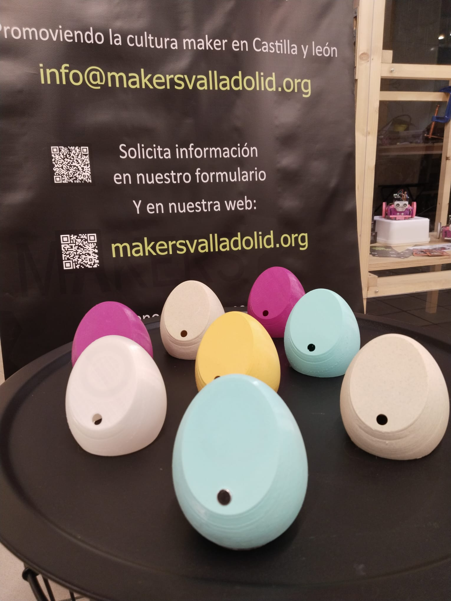
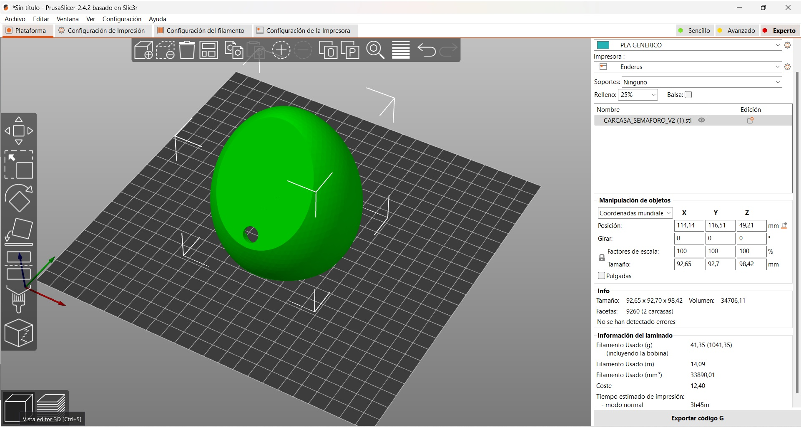
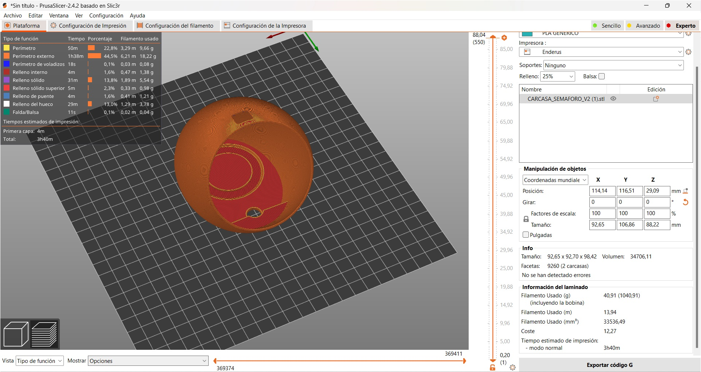
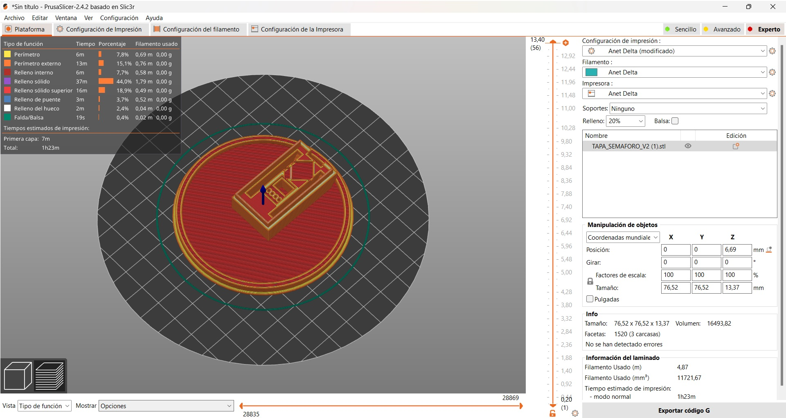

# Semáforo de Ruido

Un dispositivo interactivo que indica visualmente el nivel de ruido ambiental mediante un sistema de semáforo, ayudando a mantener entornos acústicamente saludables.

## 📋 Descripción

Este proyecto implementa un medidor de nivel de ruido ambiental que visualiza los decibelios detectados a través de una tira de LEDs NeoPixel. Funciona como un semáforo de ruido:
- 🟢 **Verde**: Niveles bajos (< 70 dB) - Seguros para exposición prolongada
- 🟡 **Amarillo**: Niveles moderados (70-85 dB) - Pueden ser molestos con exposición continua
- 🔴 **Rojo**: Niveles altos (> 85 dB) - Riesgo de daño auditivo con exposiciones prolongadas

## 🔧 Componentes

- Arduino (compatible con AVR)
- Micrófono electret con amplificador
- Tira de LEDs NeoPixel (WS2812B)
- Componentes electrónicos básicos (resistencias, capacitores)
- Carcasa impresa en 3D

## ⚙️ Características

- Muestreo de sonido ambiente y cálculo de nivel en decibelios (dB)
- Visualización del nivel de sonido en la tira de LEDs con escala de colores
- Rango calibrado aproximadamente de 40 a 90 dB
- Efecto de flash pulsante cuando se detectan niveles peligrosos
- Animaciones de inicio tipo arcoíris

## 📁 Estructura del Proyecto

- **ArduinoCode/**: Código fuente para Arduino
- **DISEÑO 3D/**: Archivos de diseño 3D para la carcasa (formatos .blend)
- **Electronica/**: Esquemas electrónicos y diagramas de conexión
- **Imagenes/**: Fotografías del proyecto terminado

## 📥 Instalación

1. Construye el circuito según el diagrama en la carpeta `Electronica/`
2. Imprime las piezas 3D desde los archivos en la carpeta `DISEÑO 3D/`
3. Carga el código `SemaforoDeRuido.ino` en tu Arduino usando el IDE de Arduino

## 🔌 Montaje

El proceso de montaje incluye la preparación del laminado para la carcasa:

  
  

También se debe colocar correctamente la tapa:

  

## 🛠️ Uso

Una vez instalado y encendido, el semáforo se calibrará automáticamente y comenzará a mostrar:
- Nivel bajo (verde): Por debajo de 70 dB
- Nivel moderado (amarillo): Entre 70 dB y 85 dB
- Nivel alto (rojo): Por encima de 85 dB, con efecto de flash para alertar de condiciones peligrosas

## 🧪 Calibración

El dispositivo viene pre-calibrado para detectar niveles de ruido típicos en entornos como aulas, oficinas y espacios públicos. Para entornos con condiciones acústicas especiales, se puede ajustar la variable `DbCalibration` en el código.

## 🤝 Contribuciones

Las contribuciones son bienvenidas. Si deseas mejorar este proyecto, puedes:
- Mejorar la precisión de la medición de decibelios
- Añadir conectividad para registro de datos
- Optimizar el consumo de energía
- Mejorar el diseño 3D

## 📄 Licencia

Este proyecto está bajo la Licencia MIT - ver el archivo LICENSE para más detalles.
